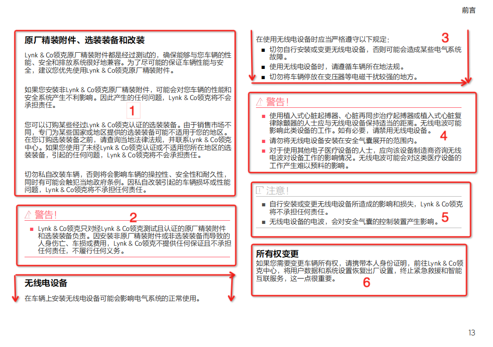
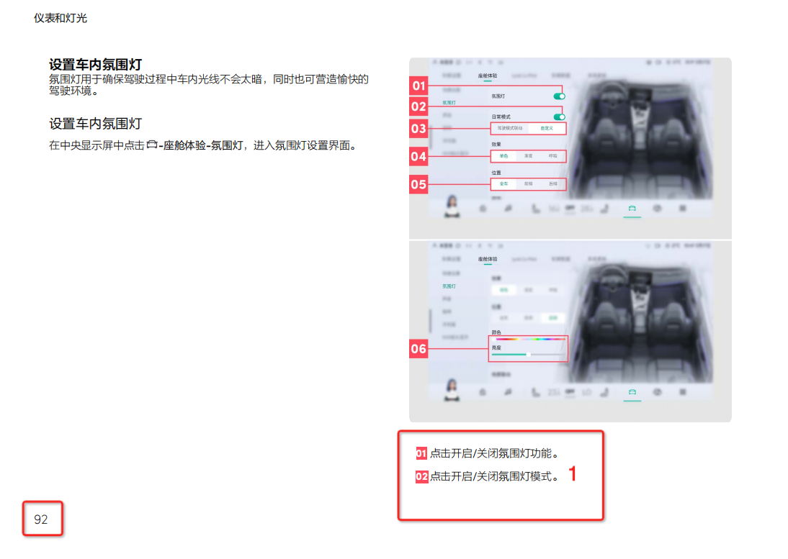
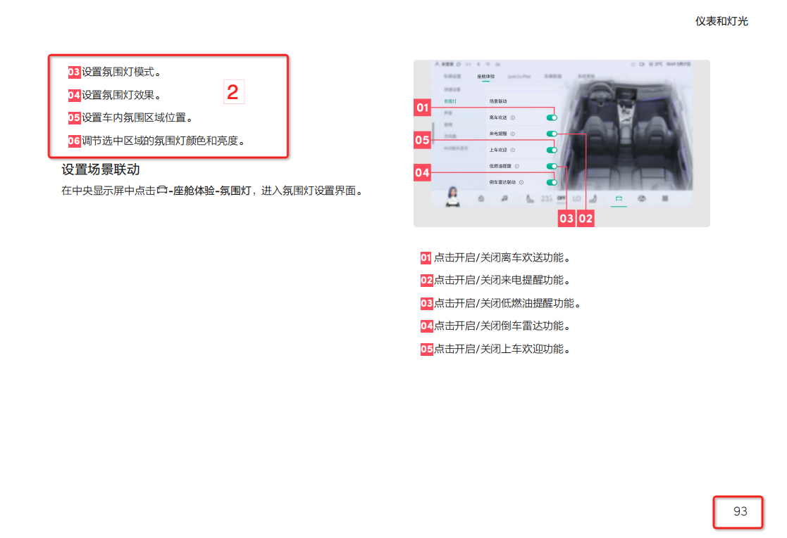

## Tianchi-LLM-QA
阿里天池: 2023全球智能汽车AI挑战赛——赛道一：AI大模型检索问答 baseline 80+

<p align="center">
  
  
  
</p>


### 1、代码结构

```text
.
├── Dockerfile
├── README.md
├── bm25_retriever.py
├── build.sh
├── config.py
├── data
│   ├── result.json
│   ├── test_question.json
│   └── train_a.pdf
├── faiss_retriever.py
├── vllm_model.py
├── pdf_parse.py
├── pre_train_model
│   ├── Qwen-7B-Chat
│   │   └── download.py
│   ├── bge-reranker-large
│   └── m3e-large
├── qwen_generation_utils.py
├── requirements.txt
├── rerank_model.py
├── run.py
├── run.sh
└── vllm_wrapper.py
```

### 2、[赛题概述](https://tianchi.aliyun.com/competition/entrance/532154)
#### 2.1 赛题：基于大模型的文档检索问答

任务：本次比赛要求参赛选手以大模型为中心制作一个问答系统，回答用户的汽车相关问题。参赛选手需要根据问题，在文档中定位相关信息的位置，并根据文档内容通过大模型生成相应的答案。本次比赛涉及的问题主要围绕汽车使用、维修、保养等方面，具体可参考下面的例子：

问题1：怎么打开危险警告灯？
答案1：危险警告灯开关在方向盘下方，按下开关即可打开危险警告灯。

问题2：车辆如何保养？
答案2：为了保持车辆处于最佳状态，建议您定期关注车辆状态，包括定期保养、洗车、内部清洁、外部清洁、轮胎的保养、低压蓄电池的保养等。

问题3：靠背太热怎么办？
答案3：您好，如果您的座椅靠背太热，可以尝试关闭座椅加热功能。在多媒体显示屏上依次点击空调开启按键→座椅→加热，在该界面下可以关闭座椅加热。

#### 2.2 2.2 数据(复赛数据官方只提供部分参考样式)

[初赛训练数据集.pdf](https://tianchi-race-prod-sh.oss-cn-shanghai.aliyuncs.com/file/race/documents/532154/%E5%88%9D%E8%B5%9B%E8%AE%AD%E7%BB%83%E9%9B%86/%E5%88%9D%E8%B5%9B%E8%AE%AD%E7%BB%83%E6%95%B0%E6%8D%AE%E9%9B%86.pdf?Expires=1703022585&OSSAccessKeyId=LTAI5t7fj2oKqzKgLGz6kGQc&Signature=pg9tnYgHDLkAlfCU%2Bs3h3QBrvfA%3D&response-content-disposition=attachment%3B%20)

[测试问题.json](https://tianchi-race-prod-sh.oss-cn-shanghai.aliyuncs.com/file/race/documents/532154/%E5%85%B6%E5%AE%83/%E6%B5%8B%E8%AF%95%E9%97%AE%E9%A2%98.json?Expires=1703022684&OSSAccessKeyId=LTAI5t7fj2oKqzKgLGz6kGQc&Signature=kTn%2BN4ZnY9tftVmz5kjNKOCoFAs%3D&response-content-disposition=attachment%3B%20)


### 3、解决方案

#### 3.1 pdf解析

##### 3.1.1 pdf分块解析

如图所示，我们希望pdf解析能尽可能的按照快状进行解析，每一块当做一个样本，这样能尽可能的保证pdf中文本内容的完整性

##### 3.1.2 pdf 滑窗法解析


如图1,2 所示，我们可以看到图1和图2上下文是连续的，如何保证文本内容的跨页连续性问题，我们提出滑窗法。
具体的把pdf中所有内容当做一个字符串来处理，按照句号进行分割，根据分割后的数组进行滑窗。具体的如下所示:

["aa","bb","cc","dd"]

如果字符串长度为4, 经过滑窗后的结果如下:

aabb

bbcc

ccdd

#### 3.2 召回

召回主要使用langchain中的retrievers进行文本的召回。我们知道向量召回和bm25召回具有互补性，因此选用了这两个进行召回

##### 3.2.1 向量召回

向量召回利用 FAISS 进行索引创建和查找，embedding 利用 [M3E-large](https://modelscope.cn/models/Jerry0/M3E-large/summary) 或者[bge-large-zh](https://modelscope.cn/models/AI-ModelScope/bge-large-zh/summary)

##### 3.2.2 bm25召回

bm25召回利用 langchain自带的bm25 retrievers

#### 3.3 重排序

1、重排序是对召回的文本进行进一步的重排，以获得更精准，数据量更少的可能答案。
2、向量召回中使用的是bi-encoder结构，而bge-reranker-large 使用的是 cross-encoder结构，cross-encoder结构一定程度上要优于bi-encoder

##### 3.3.1 cross-encoder

重排序此处使用了 [bge-reranker-large](https://modelscope.cn/models/Xorbits/bge-reranker-large/files)

#### 3.4 推理优化

##### 3.4.1 vllm batch

vllm 利用page attention 技术是推理速度得到提升，batch推理比普通推理有接近1倍的提升空间

##### 3.4.2 tensorRT-LLM

tensorRT-LLM是英伟达推出的推理框架,并且提供了c++和python的调用方式。关于qwen的tensorRT-LLM使用请参考官方介绍[tensorRT-LLM Qwen](https://github.com/NVIDIA/TensorRT-LLM/tree/main/examples/qwen)

### 4、排名

[初赛2名](https://tianchi.aliyun.com/competition/entrance/532154/rankingList)
[复赛13名](https://tianchi.aliyun.com/competition/entrance/532154/rankingList)
